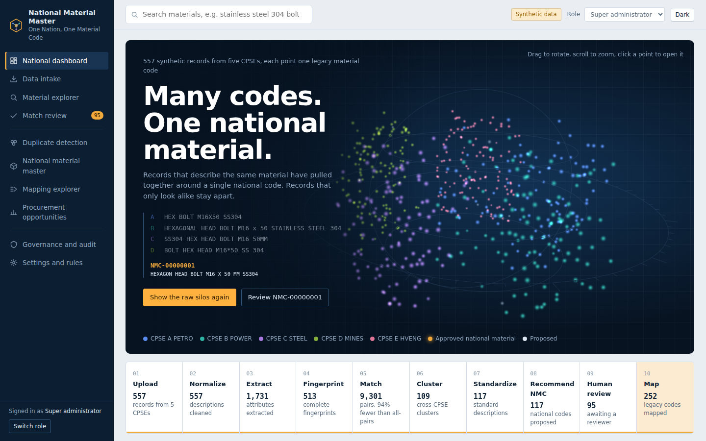
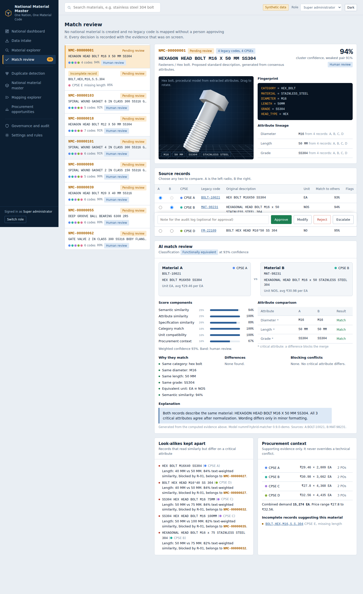
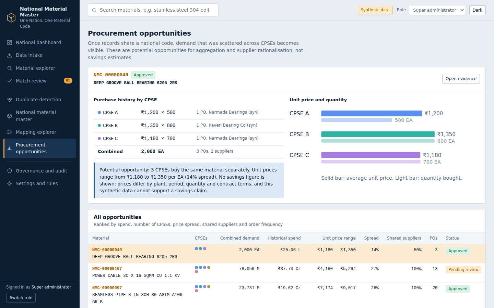

# National Material Master

**One Nation, One Material Code.** A frontend prototype of the National Unified Material Master Framework for Central Public Sector Enterprises (CPSEs), built for Smart India Hackathon 2026.

Every CPSE keeps its own ERP and legacy material codes. The platform recognises when records from different CPSEs describe the same physical material, proposes one permanent national code for it, and lets a human expert approve it with full evidence and an audit trail.



## What it does

- **Normalizes** messy descriptions: `S.S.304`, `STAINLESS STEEL 304` and `SS 304` all become `SS304`; `DN100` and `100NB` become `4 IN`.
- **Extracts attributes** per category (diameter, length, grade, pressure class, schedule, rating, voltage and more) and builds a material fingerprint.
- **Matches** with a hybrid score: semantic, attribute, specification, category, unit and procurement similarity, with configurable weights.
- **Never merges look-alikes.** If a critical attribute differs (SS304 vs SS316, M16×50 vs M16×100, 10 HP vs 20 HP, Class 150 vs 300), the merge is blocked regardless of text similarity.
- **Human-in-the-loop review** with approve, modify (versioned), reject (code retired) and escalate, plus second-level approval for low-confidence matches.
- **Procurement opportunities** across CPSEs (combined demand, price spread, shared suppliers), with no savings claims.
- **Governance:** append-only audit log, recommendation records, role-based access and tenant isolation.
- **3D visualisation** in Three.js: a constellation where records converge into national materials, and procedural 3D models generated from extracted attributes.





## Example

| CPSE | Legacy code | Description |
|---|---|---|
| A | BOLT-10021 | HEX BOLT M16X50 SS304 |
| B | MAT-98231 | HEXAGONAL HEAD BOLT M16 x 50 STAINLESS STEEL 304 |
| C | 772819 | SS304 HEX HEAD BOLT M16 50MM |
| D | FM-22109 | BOLT HEX HEAD M16*50 SS 304 |

All four map to **NMC-00000001: HEXAGON HEAD BOLT M16 X 50 MM SS304**.

## Run it

No build step and no backend. Open `index.html` in a browser, or serve the folder:

```bash
npx serve .
```

Run the pipeline tests:

```bash
npm test
```

## Screens

National dashboard, data intake (CSV/JSON upload with validation), material explorer, match review, duplicate detection, national material master, mapping explorer, procurement opportunities, governance and audit, settings and rules.

Try switching roles in the top bar. A CPSE administrator only sees their own CPSE's codes; auditors and viewers are read-only.

## Tech stack

| Layer | Choice |
|---|---|
| UI | Vanilla JavaScript, hash routing, CSS custom properties (light and dark themes) |
| 3D | Three.js r128: custom point shaders, BufferGeometry, raycasting, procedural LatheGeometry models |
| Matching | Client-side pipeline: normalization, rule-based extraction, blocking, TF-IDF character n-gram similarity, Jaro-Winkler, domain rules |
| Persistence | Browser localStorage for decisions, uploads and audit log |
| Fonts | IBM Plex Sans and IBM Plex Mono |

## Project structure

```
index.html                     App shell
css/styles.css                 Design tokens, layout, components
js/pipeline.js                 Synthetic data, normalization, extraction, matching, clustering, evaluation
js/scenes.js                   Three.js constellation and material model viewer
js/app.js                      State, routing, screens, review workflow, audit
test/pipeline.test.js          Pipeline tests (Node)
docs/                          Screenshots and documentation assets
dist/                          Standalone distribution (single-file bundle & archive)
```

## Evaluation

The synthetic dataset is generated from known canonical items, so results can be measured against ground truth: 100% matching precision (zero wrong merges), about 87% recall (missed pairs are incomplete records routed to human review), and 100% attribute extraction accuracy on stated attributes.

## Notes

- All CPSEs, records, prices, suppliers and reviewers are **synthetic**.
- Semantic similarity uses a TF-IDF character n-gram vectorizer as a stand-in for embedding models; explanations are generated from the computed evidence. A production version would add an embedding model, an LLM explanation layer, a backend API and OAuth2/JWT authentication.
- Decisions persist in your browser. Use **Settings → Reset demonstration** to start fresh.

## Author

**Yashas S** · [@buildwithyashas](https://instagram.com/buildwithyashas)

## License

MIT
